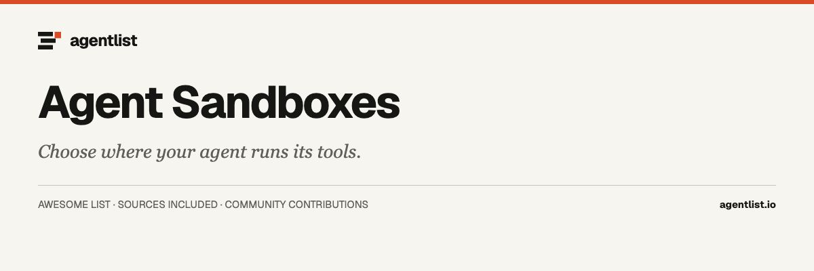

  

# Awesome Agent Sandboxes

  

> Execution sandboxes, browser environments, and isolation runtimes for AI agents.

46 projects · Upstream documentation checked 2026-09-30. Curated by [agentlist.io](https://www.agentlist.io).

**Give your agent a place to work, with boundaries you can inspect.**

Before leaving an agent to run code, decide which files, networks, and credentials it needs. Then decide what should survive the task. This list helps you compare execution environments and their building blocks; the word sandbox alone does not establish an isolation guarantee.

Environments for running agent tools or untrusted code, plus the isolation runtimes used to build them. Browser automation libraries alone are excluded. A listing is not a security certification.

## Contents

- [How to choose](#how-to-choose)
- [Decision table](#decision-table)
- [Agent execution platforms](#agent-execution-platforms)
- [Control APIs, not isolation boundaries](#control-apis-not-isolation-boundaries)
- [Local and self-managed environments](#local-and-self-managed-environments)
- [Browser environments](#browser-environments)
- [Isolation building blocks](#isolation-building-blocks)
- [Related awesome lists](#related-awesome-lists)
- [More from Agentlist](#more-from-agentlist)
- [Contributing](#contributing)

## How to choose

- Works with: Can your agent run the required commands, language runtimes, browser, and tools in this environment?
- Runs where: Is execution on your machine, your infrastructure, or a hosted service? What isolation mechanism is documented?
- Needs access to: How are filesystem mounts, outbound networking, and credentials restricted? What must you configure yourself?
- Keeps what: Are files ephemeral or persistent? Can you snapshot, resume, export, and clean up an environment?
- Human involvement: Can you inspect work, interrupt execution, and require approval before consequential actions?
- Main limitation: Which workloads or threats fall outside the documented boundary? Check startup behavior, resource limits, and persistence against your task.

Use these questions with the decision table. Every entry summarizes its linked documentation. These lists were not install-tested, so entries do not repeat that. A capability the linked page does not state is unknown.

## Decision table

Rows are situations a cited page can separate. A project missing from a row is still in the catalog below. Unresolved means the cited page does not say.

| When you need | Documented fit | What the docs separate | Unresolved | Source |
| --- | --- | --- | --- | --- |
| When a local microVM should see host files versus a private clone. | Docker Sandboxes can passthrough-mount host files, or use clone mode so the host repo stays read-only. | The architecture page says passthrough shows the agent the actual host files at the same path, while clone mode mounts the host repo read-only and the agent works in a private clone. | Unknown: the cited page covers local sandboxes only. | [source](https://docs.docker.com/ai/sandboxes/architecture/) |
| Whether a hosted microVM page names its hypervisor. | Vercel Sandbox names Firecracker. Deno Sandboxes and Blaxel document microVMs and do not name a hypervisor. | Vercel documents each sandbox as a Firecracker microVM. The Deno docs index and the Blaxel homepage describe microVMs and do not name Firecracker or another monitor. | Unknown: host setup for those microVMs is not stated on the Vercel README, the Deno docs index, or the Blaxel homepage. | [source](https://github.com/vercel/sandbox) |
| When a language-level interpreter is enough instead of a VM. | Monty is a restricted Python interpreter. Docker Sandboxes and Deno Sandboxes are microVMs with a Linux filesystem. | Monty documents that filesystem, environment variables, and network do not exist inside the interpreter, and the host is reached only through functions and mounts you pass in. | Unknown: the Python subset and snapshot limits are on a docs page separate from this README. | [source](https://github.com/pydantic/monty) |
| Where the browser runs, and whether the host names isolation. | Browserbase is hosted. Browserless and Steel Browser document a Docker image and a cloud. AIO Sandbox shares one container with the shell. | Browserbase's homepage names live view and session replay but not how long they are kept, and neither that page nor the docs intro names an isolation mechanism. | Unknown: the docs do not name an isolation mechanism. Default logging is on unless a session disables it. | [source](https://docs.browserbase.com/account/enterprise/zero-data-retention) |
| Whether sandbox files survive after the session ends. | Deno Sandboxes are ephemeral by default and offer volumes. Docker Sandboxes keep in-sandbox files until sbx rm. Blaxel also sells volumes. | Deno documents ephemeral disk plus volumes. Docker keeps in-sandbox files until sbx rm, and a direct mount lives on the host. Blaxel sells volumes and says the sandbox root filesystem is wiped when destroyed. | Unknown: Deno volume behavior is on a linked page, not in the limits list. | [source](https://docs.deno.com/sandbox/) |
| How a real API credential can stay outside the guest. | Docker Sandboxes and Deno Sandboxes substitute secrets on the way out. Runloop docs say gateways do not expose real credentials to the devbox. | Docker says the agent sees a sentinel and the host proxy inserts the real credential after the request leaves the microVM. Deno substitutes the real value only on outbound requests to approved hosts. | Unknown: whether guest code can later read the injected secret is not stated on these pages. | [source](https://docs.docker.com/ai/sandboxes/architecture/) |
| Whether you want an isolation primitive or a product that uses one. | gVisor, Firecracker, and Kata Containers are building blocks. Dormice names a gVisor executor. Kubernetes Agent Sandbox schedules onto gVisor or Kata Containers. | gVisor's README presents runsc as an OCI runtime for Docker and Kubernetes, and says gVisor is not a virtual machine and not a syscall filter. Those product entries name the primitive instead of being it. | Unknown: Firecracker and Kata Containers pins were not rechecked against their current READMEs. | [source](https://github.com/google/gvisor) |
| Whether the public Daytona repository is still the product. | Daytona is the hosted product name. Its public GitHub repository is no longer maintained. | As of June 2026, core development moved to a private codebase. The public repository gets no further updates, fixes, or releases, and stays public under the license pinned at v0.190.0. | Unknown: the private tree and what the hosted product runs now are not in this public repository. | [source](https://github.com/daytonaio/daytona) |
| Whether Blaxel continues after the Baseten acquisition. | Blaxel remains the sandbox entry. The Baseten post says the product continues and does not change. | The 2026-09-10 post says Baseten has acquired Blaxel, Blaxel is continuing, the product does not change, and features will keep shipping. Each agent gets its own microVM, and persistent storage can outlive a run. | Cited page covers this. | [source](https://www.baseten.co/blog/blaxel-is-joining-baseten-to-build-the-future-of-agentic-cloud/) |
| How long a Deno sandbox lives and where its secrets go. | Deno Sandboxes cap lifetime at 30 minutes and substitute secrets only for approved outbound hosts. | The docs index, updated March 19, 2026, says Linux microVMs are ephemeral by default, with volumes, a lifetime up to 30 minutes, and 10 GB of ephemeral disk. It does not name Firecracker. | Unknown: the hypervisor is unnamed here, and volume durability is on a linked page rather than the limits list. | [source](https://docs.deno.com/sandbox/) |
| What isolation mechanism E2B's README actually names. | E2B documents cloud sandboxes and SDKs. Unlike Vercel Sandbox, the README does not name a hypervisor. | The README documents JavaScript and Python SDKs, a Code Interpreter package, a Desktop SDK, and self-hosting via a separate runtime repository and Terraform. It does not name a hypervisor, kernel, or snapshot format. | Unknown: the E2B README does not name the isolation mechanism, so none is inferred here. | [source](https://github.com/e2b-dev/E2B) |

## Agent execution platforms

- [Cloudflare Sandbox SDK](https://github.com/cloudflare/sandbox-sdk) - SDK that adds file copy, S3 mounts, and directory backup to a Cloudflare Container a Worker Durable Object starts. The Worker chooses the sandbox, internet access, and allowed hosts. Bucket credentials stay in the Worker, which signs storage requests. A directory backup can be restored into another container. Version 1.0 no longer runs commands for you. **Cloud platform SDK.**
- [Daytona](https://www.daytona.io/) - Hosted environment for running generated code. The public repository is no longer maintained. As of June 2026, core development moved to a private codebase. The repository receives no further updates, fixes, or releases, and stays public under the license pinned at v0.190.0, without support. The product site remains up. **Sandbox platform.**
- [Docker Sandboxes](https://docs.docker.com/ai/sandboxes/) - Docker's architecture page describes local sbx sandboxes as microVMs, with a comparison row of Full (hypervisor): a workspace passthrough shows the agent the host files, clone mode keeps the host repo read-only while the agent works in a private clone, a host proxy leaves the real credential outside the guest, and in-sandbox files last until sbx rm. Cloud behavior is a different page. **Local or hosted.**
- [E2B](https://github.com/e2b-dev/E2B) - Cloud service for running generated commands, with JavaScript and Python SDKs that need an API key. It includes a Code Interpreter package for runCode and a Desktop SDK for mouse, keyboard, screenshots, and streaming, plus self-hosting through a separate runtime repository and Terraform. It does not name the isolation mechanism or a snapshot format. **Cloud sandbox.**
- [OpenSandbox](https://github.com/opensandbox-group/OpenSandbox) - Sandbox server you can start on Docker and later run on Kubernetes, with one lifecycle API for commands, files, and code. It ships Python, Java, TypeScript, .NET, and Go SDKs, an osb CLI, and MCP, plus per-sandbox egress policy and a credential vault so a real secret need not sit in the workload. A Firecracker runtime with pause and resume is described for Kubernetes. **Deployable platform.**
- [Vercel Sandbox](https://github.com/vercel/sandbox) - SDK and CLI for ephemeral Linux microVMs on Vercel's infrastructure. Each sandbox is a Firecracker microVM. You authenticate through a linked Vercel project. Duration defaults to five minutes. Hobby is 45 minutes, and Pro or Enterprise is 24 hours. You can seed a repository, run commands, and expose ports. This repository has no self-hosted server. **Cloud sandbox.**
- [CubeSandbox](https://github.com/TencentCloud/CubeSandbox) - Self-hosted sandbox service, built on RustVMM and KVM, for single-node or clustered microVMs. Each sandbox has its own kernel. The project ships an E2B-compatible API, a credential vault, volumes, and automatic pause and resume, with Terraform, a Kubernetes preview, or a QEMU virtual machine when KVM is missing. The main guide asks for x86_64 Linux with KVM. **Self-hosted microVM.**
- [Kubernetes Agent Sandbox](https://github.com/kubernetes-sigs/agent-sandbox) - Kubernetes controller for one long-lived pod with a stable hostname and optional storage. It is an orchestrator, not an isolation runtime. It schedules onto gVisor or Kata through a RuntimeClass you configure. Extensions add templates, a warm pool, and claims. Go and Python SDKs, plus pause and resume, are documented. This is not an agent product. **Kubernetes controller.**
- [BoxLite](https://github.com/boxlite-ai/boxlite) - Library that runs OCI images in microVMs on your machine, with an optional cloud control plane. Python, Node, Go, and Rust embeds can exec commands without a daemon. Isolation uses KVM or Hypervisor.framework plus an OS sandbox. Disk state persists. Secret placeholders keep real values out of the guest. An allow list can limit egress, and a hypervisor is required. **MicroVM runtime.**
- [Beam](https://github.com/beam-cloud/beta9) - Python API for isolated containers that run generated code, plus GPU inference endpoints and task queues. Beta9 is the open-source engine behind Beam's hosted cloud. You can self-host Beta9 or use the managed service with an account and beam-client. A sandbox is created in code and can run a snippet remotely. No separate export format is documented. **Serverless platform.**
- [Celesto](https://github.com/CelestoAI/celesto) - CLI and Python SDK for virtual machines that run commands, a browser, or a desktop, locally or in Celesto Cloud. macOS setup installs QEMU. Stop keeps files and delete removes them. Host mounts are read-only unless writable. Network is on by default. Linux Firecracker restricted networking cannot combine with host mounts. Presets include Claude Code and Codex. Snapshots are Linux-only. **Local or hosted VM.**
- [OpenShell](https://github.com/NVIDIA/OpenShell) - Local gateway and CLI that start sandboxes and enforce policy on files, system calls, and network connections. Credentials are added only on approved endpoints. Policy changes can wait for review after a check. Compute can be Docker, Podman, or host virtualization on Linux, Apple Silicon, or experimental Windows WSL 2. SDKs call the gateway. Helm needs your CNI for NetworkPolicy. **Policy runtime.**
- [Coder](https://github.com/coder/coder) - Self-hosted platform for development workspaces and AI coding agents. Workspaces are Terraform templates on Docker, Kubernetes, or EC2, connected over a WireGuard tunnel. The Coder Agents loop runs in the control plane so model API keys are not placed in the workspace. Claude Code, Codex, and OpenCode are named. Idle shutdown is documented. Isolation is whatever the template provisions. **Dev environment platform.**
- [Sandcastle](https://github.com/mattpocock/sandcastle) - TypeScript library that runs coding agents in Docker, Podman, or Vercel Sandbox and can merge their git commits back. noSandbox runs on the host with no container. Docker and Podman bind-mount the workspace, so Sandcastle does not add a boundary of its own. You need git and a provider. The scaffold expects a Claude credential in a local env file. **TypeScript orchestrator.**
- [Dormice](https://github.com/BitMiracle-AI/Dormice) - Self-hosted sandbox daemon with a SQLite ledger, a Docker and gVisor executor, and a lifecycle that can freeze, stop, archive, and restore sandboxes. One key returns the same sandbox. Idle sandboxes cool down in place. The official E2B SDK can be pointed at Dormice by changing two URLs. The project marks this work as early development and not production-ready. **Self-hosted platform.**
- [Modal Sandboxes](https://modal.com/docs/guide/sandboxes) - Modal's Sandbox API starts containers for untrusted or generated code. You can select a gVisor runtime or a VM runtime. A sandbox stops after five minutes unless you set a timeout up to 24 hours. Filesystem snapshots can preserve state past that limit. There is no public server repository. **Hosted sandbox.**
- [Sprites](https://fly.io/sprites/) - Fly.io Sprites are hosted Linux environments for agents, with a disk that survives sleep and filesystem checkpoints. Connectors can call external services without placing the credential inside the Sprite. Fly describes Sprites as computers rather than sandboxes, with persistence coming from that surviving disk and the checkpoints. **Hosted agent computer.**
- [Deno Sandboxes](https://deno.com/deploy/sandbox) - SDK for Linux microVMs on Deno Deploy. The docs index, last updated March 19, 2026, describes ephemeral sandboxes by default, volumes for durable storage, a lifetime of up to 30 minutes, and 10 GB of ephemeral disk. Secret values never enter the sandbox. They are substituted only on outbound requests to approved hosts. **Hosted sandbox.**
- [Blaxel](https://blaxel.ai/) - Hosted agent runtime with one microVM per sandbox, persistent volumes, and a root filesystem wiped when the sandbox is destroyed. A Baseten post dated 2026-09-10 records that Baseten has acquired Blaxel, that Blaxel is continuing, that the product does not change, and that features will keep shipping. **Hosted sandbox.**
- [Runloop](https://runloop.ai/) - Hosted code sandboxes for agents. The homepage calls a Devbox a micro-VM plus a container and describes snapshotting disk state and SSH, while the Devbox docs call them ephemeral virtual machines and say agent gateways connect without exposing real credentials to the devbox; Python and TypeScript SDKs are public. **Hosted sandbox.**
- [SWE-ReX](https://github.com/SWE-agent/SWE-ReX) - Python interface for agent shell sessions on the local machine, Docker, an AWS host, Modal, or Fargate. The same calls work across those backends, including interactive programs and several sessions at once. A Daytona extra is still work in progress. It has no isolation boundary, retention format, or approval step of its own. The boundary is the chosen backend's. **Execution interface.**
- [AgentScope Runtime](https://github.com/agentscope-ai/agentscope-runtime) - Python runtime that deploys agent apps and runs tool calls in sandboxes for shell, Python, GUI, browser, files, or mobile. Deploy locally, on Kubernetes, or serverless. AgentScope, the Microsoft Agent Framework, and Agno are supported. LangGraph and AutoGen are only partly filled in. These capabilities moved into AgentScope 2.0. This read-only repository will be archived soon. **Agent runtime.**
- [OpenKruise Agents](https://github.com/openkruise/agents) - Kubernetes operator from OpenKruise for agent sandbox lifecycle, with Kubernetes APIs and an E2B-style SDK. It pools resources, can hibernate and checkpoint memory and disk, and routes sessions without a Service for every user. It can use SIG agent-sandbox APIs when installed, so isolation depends on the cluster runtime. No standalone process is documented without Kubernetes. **Kubernetes operator.**

## Control APIs, not isolation boundaries

- [Sandbox Agent](https://github.com/rivet-dev/sandbox-agent) - HTTP API that runs inside a sandbox you already operate and drives Claude Code, Codex, OpenCode, Cursor, Amp, or Pi. It streams events and handles permission requests. It does not persist those sessions and it does not add an isolation boundary. Embedded mode can start the agents as local subprocesses. **Control API.**

## Local and self-managed environments

- [AIO Sandbox](https://github.com/agent-infra/sandbox) - One Docker image with a shell, files, browser and VNC, Jupyter, MCP, and VS Code on a shared filesystem, plus Python, JavaScript, and Go HTTP clients. Without an API key, services stay open on port 8080. The sample docker command sets seccomp unconfined, so bind it to localhost or a proxy. It is one container, not a kernel per task. **Container environment.**
- [Anthropic Sandbox Runtime](https://github.com/anthropics/sandbox-runtime) - srt applies filesystem and network rules to a process tree and is not a virtual machine. macOS uses sandbox-exec. Linux uses bubblewrap with the guest network namespace removed. Windows uses a local user and a firewall fence. Network stays denied until allowed domains, and traffic goes through host proxies. This research preview does not replace the OS sandbox it calls. **Process restrictions.**
- [Microsandbox](https://github.com/superradcompany/microsandbox) - MicroVM runtime with an msb CLI and Python, TypeScript, Rust, and Go SDKs. It runs OCI images, can fork a live sandbox, and can snapshot and restore state, including detached sessions. A sample config allow-lists outbound hosts, and secrets need not enter the guest. It requires Apple Silicon, Linux KVM, or Windows WHP. The project is still called beta. **Local VM runtime.**
- [Monty](https://github.com/pydantic/monty) - Restricted Python interpreter in Rust, not a virtual machine. Filesystem, environment variables, and network do not exist inside. The host is reached only through functions and mounts you pass in. Packages exist for Python, JavaScript, and Rust. Full Monty is a separate commercial server behind a WebSocket. Snapshots and a Python subset are documented on the docs site. **Python interpreter.**
- [Agent Safehouse](https://github.com/eugene1g/agent-safehouse) - macOS command that wraps coding agents with sandbox-exec profiles and a deny-first policy. Default access is narrower than a full home directory, and you add the paths and integrations the agent needs. Profiles exist for major coding agents. It is a Seatbelt layer, not a virtual machine, and not a boundary against a determined attacker. Linux is outside this tool. **macOS process sandbox.**
- [Fence](https://github.com/fencesandbox/fence) - CLI that runs a command or a coding agent with network blocked unless a template allow-lists domains, plus filesystem and command rules you configure. macOS uses sandbox-exec and Linux uses bubblewrap. It can import Claude Code permissions and wrap Claude Code, Codex, and other CLIs. It adds no guest kernel. Windows is only via Nix on WSL. **Process restrictions.**
- [CodeRunner](https://github.com/instavm/coderunner) - Apple Silicon installer that starts a container you can stop and resume, keeping uploads and packages. It includes an MCP server, a Claude Desktop proxy, and a path for Claude Code. Network is open unless you set none mode at creation, and resume cannot change that mode. It uses Apple's container CLI. Hosted InstaVM is mentioned and not listed separately. **Local container sandbox.**
- [Vibe](https://github.com/lynaghk/vibe) - Binary that boots a Linux VM on Apple Silicon and mounts the project into the guest. Mounts include Claude and Codex read-write unless changed. The guest reaches the host at a fixed address. The host cannot reach the guest, and guests cannot reach each other. The VM exits with the shell. It needs macOS 13 or newer on ARM. **macOS VM.**
- [forkd](https://github.com/deeplethe/forkd) - Linux daemon that boots one Firecracker parent microVM, then starts copy-on-write child microVMs. It includes a REST API plus Python, TypeScript, and MCP clients, and a branch operation that snapshots a running sandbox and resumes it. Each child is its own KVM virtual machine. You supply the warmed parent on Linux. Documented CLI examples use sudo. **MicroVM runtime.**
- [Shuru](https://github.com/superhq-ai/shuru) - Local microVM CLI for agents, using Apple's Virtualization framework on macOS and experimental KVM on Linux ARM64. Each run resets the root filesystem. Network stays off until you allow hosts. Secrets stay on the host, with proxy substitution. Read-write mounts write to the host. Checkpoints can save disk. Linux is not production-ready, and Apple Silicon is the supported Mac path. **Local microVM.**
- [Coi](https://github.com/coipond/coi) - CLI that starts an Incus system container with root, systemd, and Docker, and runs Claude Code, Codex, or another CLI. The project mounts to the host with your ownership. SSH keys and environment variables stay out unless forwarded. Network can be open, restricted, or allow-listed. It needs Linux with Incus, macOS via Colima or Lima, and shares the host kernel. **Incus containers.**
- [Matchlock](https://github.com/jingkaihe/matchlock) - CLI and Go, Python, and TypeScript SDKs that launch ephemeral Linux microVMs for an agent command. An allow-host or secret seals the network, and a host proxy injects the real credential so the guest sees a placeholder. Overlays are discarded when the VM goes away. It needs Linux with KVM or Apple Silicon and is experimental, with breaking changes. **Local microVM.**
- [Sandlock](https://github.com/multikernel/sandlock) - Linux process sandbox using Landlock, seccomp-bpf, and seccomp user notifications. It uses no container, no virtual machine, and no root. Optional copy-on-write is available, and network filters can match a host and an HTTP path. Python and Go SDKs and an OCI shim are included. Full filesystem, network, and IPC rules need Linux 6.12. The process shares the host kernel. **Process sandbox.**
- [AgentBox](https://github.com/madarco/agentbox) - CLI that launches Claude Code or another agent in a local or cloud box. Locally it is a Docker container with a FUSE overlay, even where the introduction calls it a VM. Cloud targets include Hetzner, Vercel, Daytona, E2B, and DigitalOcean. Git credentials stay on the starting machine, with a permission request before push. You need Docker and Node. **Local or cloud boxes.**
- [Gondolin](https://github.com/earendil-works/gondolin) - Experimental TypeScript control plane that boots a local Linux microVM, QEMU by default, with an optional krun backend. Host-side HTTP hooks allow only named hosts and inject secrets, so the guest sees a placeholder. A CLI can attach a shell, open ingress, and snapshot a session. The snapshot command stops the VM. Filesystem modes include read-only, memory, and copy-on-write. **Local microVM.**
- [LLM Sandbox](https://github.com/vndee/llm-sandbox) - Python library that runs model-written code in Docker, Podman, or Kubernetes. Sessions cover Python, JavaScript, Java, C++, Go, and R, and a Python kernel keeps state across calls. File copy and an MCP server are included. Limits and network controls are session settings, not a separate hypervisor, so isolation is the backend's. No hosted service or approval step is documented. **Python library.**

## Browser environments

- [Browserless](https://github.com/browserless/browserless) - Docker images that serve Chromium, Firefox, or WebKit over WebSocket for Puppeteer or Playwright, plus a hosted cloud for the same API. It documents a debug viewer, session replay, an MCP server, and persistent browser state with retention. Your script stays in your process. The browser runs in the container or on their cloud. Self-hosted and enterprise images differ. **Browser environment.**
- [Steel Browser](https://github.com/steel-dev/steel-browser) - Browser API for Docker or Steel Cloud. Sessions accept Puppeteer, Playwright, or Selenium. The server keeps cookies and local storage, can add proxies and extensions, and ships a UI for sessions and request logs. A REST API can return markdown, screenshots, or PDFs. The project calls itself a public beta, and you still bring the agent logic. **Browser environment.**
- [Browserbase](https://www.browserbase.com/) - Hosted browsers for agents, with search and fetch APIs beside the browser sessions. You authenticate with an API key and the browser runs on their cloud. Docs default logSession and recordSession to true. Enterprise zero-data retention does not persist session logs or video replay, while live view still streams. These pages do not name an isolation mechanism. Stagehand is not listed. **Hosted browsers.**

## Isolation building blocks

- [Firecracker](https://github.com/firecracker-microvm/firecracker) - Virtual machine monitor that uses Linux KVM to run small microVMs with a reduced device model. You provide the kernel, root filesystem, memory, network interfaces, disks, and sockets. It is a building block for multi-tenant container and function hosts, not an agent product. Other runtimes such as Kata integrate it. Isolation also depends on the production host setup. **VM building block.**
- [gVisor](https://github.com/google/gvisor) - User-space kernel, written in Go, so a container makes fewer calls into the host. runsc is its OCI runtime for Docker and Kubernetes. gVisor is not a syscall filter and not a virtual machine in the everyday sense. It is a building block, not an agent product. It does not choose mounted files or credentials. Builds target x86_64 and ARM64. **Container isolation.**
- [Kata Containers](https://github.com/kata-containers/kata-containers) - Runtime that places workloads in lightweight virtual machines behind a guest kernel. Container managers launch it. An agent runs in the virtual machine, and Dragonball is an optional built-in VMM. It supports 64-bit x86, Arm, Power, and IBM Z with hardware virtualization. Kata is a building block, not an agent product. You choose the image, network, and mounts. **VM-backed containers.**

## Related awesome lists

Independent collections for deeper discovery. These are references, not affiliations or endorsements.

- [arjan/awesome-agent-sandboxes](https://github.com/arjan/awesome-agent-sandboxes) - Short list of code-execution sandboxes for agents.
- [fishman/awesome-agent-sandbox](https://github.com/fishman/awesome-agent-sandbox) - Local microVM, container, and process-sandbox catalog. Its default branch is master. Rows come from each project's own docs.
- [msyvr/awesome-agent-sandboxes](https://github.com/msyvr/awesome-agent-sandboxes) - Another curated sandbox link list. Confirm currency before treating it as coverage of the vendors here.
- [backblaze-labs/awesome-agent-infrastructure](https://github.com/backblaze-labs/awesome-agent-infrastructure) - Cross-cutting agent infrastructure list covering memory, sandboxes, MCP, and evaluation. Thin on any single category.
- [tizkovatereza/awesome-ai-sandboxes](https://github.com/tizkovatereza/awesome-ai-sandboxes) - Notes on hosted sandbox vendors, drawn from official pages rather than install tests.
- [fhiltscher/awesome-ai-coding-sandboxes](https://github.com/fhiltscher/awesome-ai-coding-sandboxes) - Coding-agent sandboxes ordered by the author's view of isolation and egress. Those rankings are opinions, not a certification.

## More from Agentlist

- [Awesome Agent List](https://github.com/AgentListIO/awesome-agent-list)
- [Awesome Personal Assistants](https://github.com/AgentListIO/awesome-personal-assistants)
- [Awesome Agent Clients](https://github.com/AgentListIO/awesome-agent-clients)
- [Awesome Agent Memory](https://github.com/AgentListIO/awesome-agent-memory)
- [Awesome Agent Orchestration](https://github.com/AgentListIO/awesome-agent-orchestration)
- [Awesome Agent Observability](https://github.com/AgentListIO/awesome-agent-observability)

**[Browse agents](https://www.agentlist.io/list-of-ai-agents) · [Compare agents](https://www.agentlist.io/compare) · [GitHub organization](https://github.com/AgentListIO)**

## Contributing

Missing something useful? Read the [contribution guide](CONTRIBUTING.md) and open an issue or pull request with an official source.

The machine-readable [list.json](list.json) includes a primary-source link and a documentation-check date for every entry. Descriptions are short editorial summaries of that linked documentation. Inclusion does not mean the project was installed, run, security-tested, or endorsed. Hosted services and source code may have different terms.

To update the list, edit `list.json`, run `bun run build`, then `bun run check`. The README is generated; avoid editing it directly.

[CC0](LICENSE) applies to this list’s text and data. Linked projects retain their own licenses.
